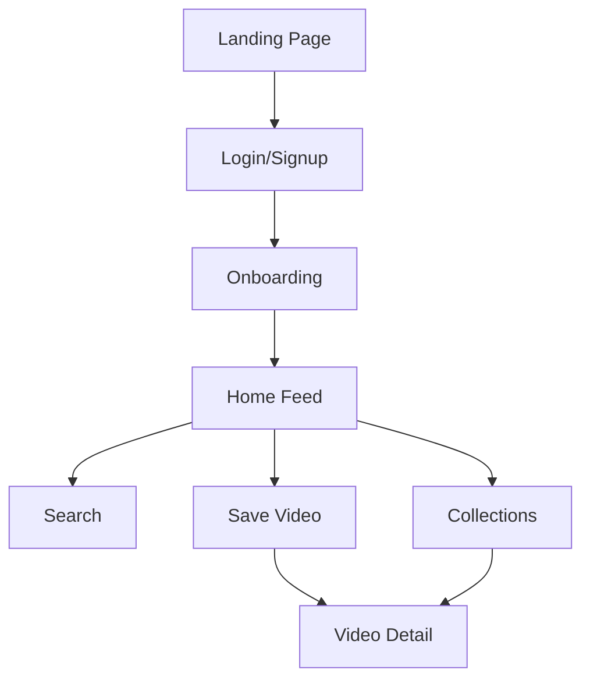

# Pocketed Design System & Architecture

This document serves as the comprehensive design and technical documentation for **Pocketed**, detailing the visual design system, architecture decisions, and implementation guidelines.

## 1. Visual Design Specifications

### Color Palette
Pocketed uses a nature-inspired, sophisticated palette that emphasizes trust and organization.

| Name | Hex | Variable | Usage |
| :--- | :--- | :--- | :--- |
| **Primary (Forest)** | `#0f6e56` | `--primary` | Main actions, branding, active states |
| **Secondary (Amber)** | `#ef9f27` | `--secondary` | Highlights, CTAs, accents |
| **Background (Off-white)** | `#f9f7f4` | `--background` | Main page background, clean canvas |
| **Foreground (Dark Green)** | `#0a2e26` | `--foreground` | Primary text, deep contrast |
| **Muted (Pebble)** | `#e5e1da` | `--muted` | Secondary text, subtle backgrounds |
| **Border (Sand)** | `#d1cdc4` | `--border` | UI boundaries, input borders |

### Typography
The typography system balances modern readability with editorial elegance.

- **Headings (Serif):** `DM Serif Display`
  - Used for large hero sections and major headers.
  - Conveys a "curated" and "premium" feel.
- **Body & UI (Sans):** `DM Sans`
  - Used for all interface elements, body text, and small labels.
  - Optimized for legibility across all devices.

**Scale:**
- **H1:** `text-5xl` (Mobile) / `text-7xl` (Desktop)
- **H2:** `text-3xl` (Mobile) / `text-5xl` (Desktop)
- **Body:** `text-base` (Standard) / `text-xl` (Lead)
- **Small:** `text-sm` (Labels, Muted text)

### Spacing System
Pocketed follows a strict 4px/8px grid system based on Tailwind CSS defaults.

- **Layout Gaps:** `gap-8`, `gap-12`, `gap-16` for section spacing.
- **Section Padding:** `py-20` for landing sections to provide "breathing room".
- **Container Max-Width:** `max-w-7xl` for main content alignment.

### Component Library
Built on top of **Radix UI** primitives for accessibility and **Tailwind CSS 4** for styling.

- **Buttons:** Support `default`, `outline`, `secondary`, `ghost`, `destructive`, and `neutral` variants.
- **Inputs:** High-contrast borders with `focus-visible:ring-ring/50`.
- **Cards:** Rounded corners (`rounded-3xl` for large containers, `rounded-lg` for UI elements).

## 2. Information Architecture

### Navigation Structure
Pocketed employs a dual navigation strategy:
- **Landing:** Traditional top-down scroll with a fixed header (implied).
- **App:** Mobile-first Bottom Navigation for quick access to core features.

### User Flows


### Content Organization
- **Videos:** The primary entity, enriched with metadata (source, tags, collection).
- **Collections:** User-defined groups for organizing saved content.
- **Profile:** User settings and account management.

## 3. Technical Design

### Technology Stack Rationale
- **Frontend:** [React 19](https://react.dev) for modern component architecture and performance.
- **Build Tool:** [Vite 8](https://vitejs.dev) for near-instant development starts and optimized builds.
- **Styling:** [Tailwind CSS 4](https://tailwindcss.com) using the new `@theme` configuration for better maintainability.
- **Animations:** [Framer Motion](https://www.framer.com/motion/) for fluid, physics-based interactions.
- **Backend:** [Supabase](https://supabase.com) for Authentication and PostgreSQL database, reducing infrastructure overhead.
- **Routing:** [React Router 7](https://reactrouter.com) for robust client-side navigation.

### Performance Optimization
- **Code Splitting:** Route-based lazy loading (via React Router).
- **Image Optimization:** Use of modern formats and responsive sizes.
- **Animation Performance:** Utilizing `layout` and `transform` properties in Framer Motion to ensure 60fps.

### Accessibility (A11y) Compliance
- **ARIA:** Utilizing Radix UI primitives which handle complex ARIA patterns automatically.
- **Contrast:** Maintaining high contrast ratios (minimum 4.5:1) for all text against backgrounds.
- **Focus States:** Visible, high-contrast focus rings (`ring-ring/50`) for keyboard navigation.

## 4. Responsive Design

### Breakpoints
Pocketed follows a mobile-first approach.
- **Mobile:** `< 640px` (Default)
- **Tablet (sm):** `640px`
- **Laptop (md):** `768px`
- **Desktop (lg):** `1024px`
- **Wide (xl):** `1280px`

### Strategy
- **Navigation:** Switches from Bottom Nav (mobile) to Sidebar/Top Nav (desktop).
- **Grid Layouts:** Single column on mobile, transitioning to 3-4 columns on desktop for video feeds.

## 5. Interaction Patterns

### User Inputs
- **Feedback:** Immediate visual feedback on input focus and validation errors.
- **States:** Hover, Active, Disabled, and Loading states are clearly defined for all interactive elements.

### Animations
- **Entrance:** Staggered children animations for lists and landing sections.
- **Transitions:** Smooth page transitions using Framer Motion.
- **Feedback:** Micro-interactions (e.g., button press `translate-y-px`) for tactile feel.

```tsx
// Example of a reusable animation pattern
const itemVariants = {
  hidden: { opacity: 0, y: 20 },
  visible: {
    opacity: 1,
    y: 0,
    transition: { duration: 0.5, ease: [0.21, 0.47, 0.32, 0.98] }
  }
};
```

## 6. Brand Guidelines

### Visual Identity
- **Logo:** Minimalist mark representing "saving" and "organizing".
- **Tone of Voice:** Helpful, efficient, and sophisticated.
- **Imagery:** High-quality, lifestyle-focused photography with subtle overlays.

### Naming Conventions
- **Components:** PascalCase (e.g., `VideoCard.tsx`).
- **Styles:** Tailwind utility classes, grouped by category (layout, spacing, typography).
- **Files:** kebab-case for assets (e.g., `logo-mark.svg`).

## 7. Maintenance & Version Control

### Design System Updates
1. **Draft:** Propose changes in a new branch.
2. **Review:** Peer review for design consistency and technical feasibility.
3. **Implement:** Update `@theme` in `index.css` and related UI components.
4. **Document:** Update this `DESIGN.md` with new tokens or components.

### Versioning
- **Current Version:** `1.0.0`
- **Last Updated:** 2026-05-07

---
*Pocketed Design Documentation - 2026*
